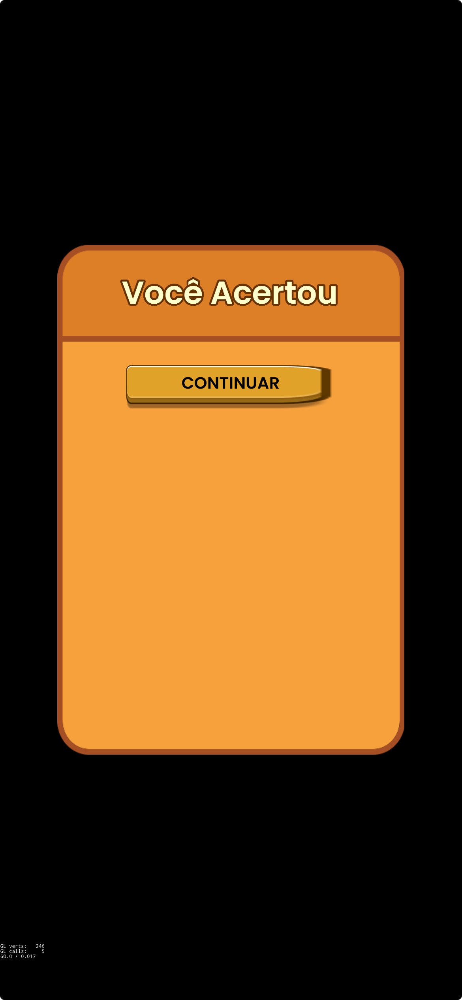
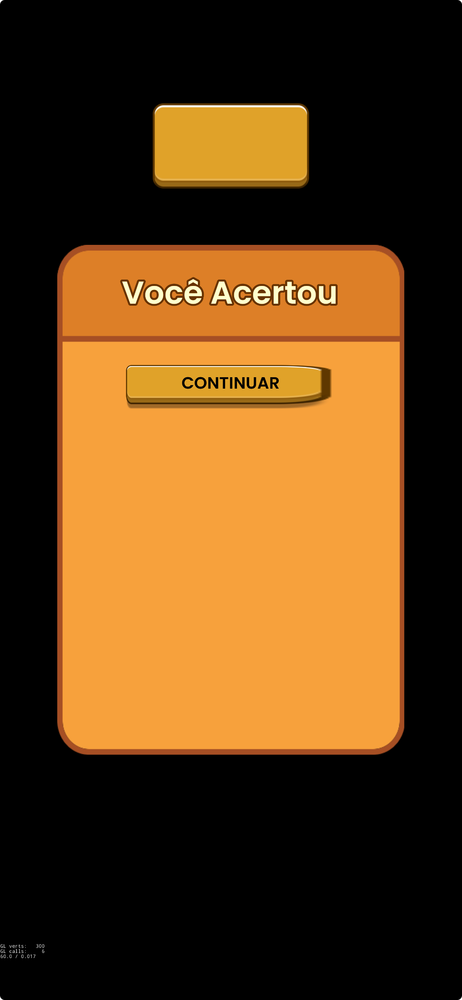

# NinePatch - Demo Bug

All devices show button wrong.

If i keep only the below line in `AppDelegate.cpp`, it works:

```cpp
glView->setDesignResolutionSize(frameSize.width, frameSize.height, ResolutionPolicy::SHOW_ALL);
```

But when i set `setContentScaleFactor` nine patch images break.

The problem appear be only in FairyGUI.

## Screenshot

Only FairyGUI:



AXMOL Normal Button and FairyGUI:


